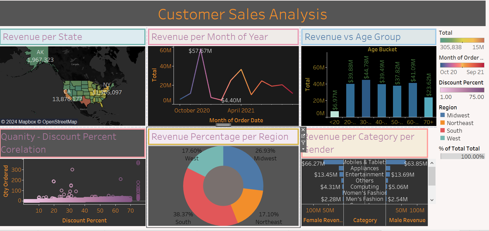

# Customer Sales Analysis

## 📊 Overview
This project analyzes customer sales data to uncover key business insights.

### Key Metrics:
- **Revenue Analysis**: Monthly and yearly trends
- **Customer Segmentation**: By gender and region
- **Discount Analysis**: Correlation between discounts and sales

### 📂 Files
- **Dataset**: [Dataset](./sales_data.csv)
- **Screenshot**: 
- **Live Dashboard**: [View Dashboard](https://public.tableau.com/views/CustomerSalesAnalysis_17324728261210/CustomerSalesAnalysis?:language=en-US&publish=yes&:sid=&:redirect=auth&:display_count=n&:origin=viz_share_link)

