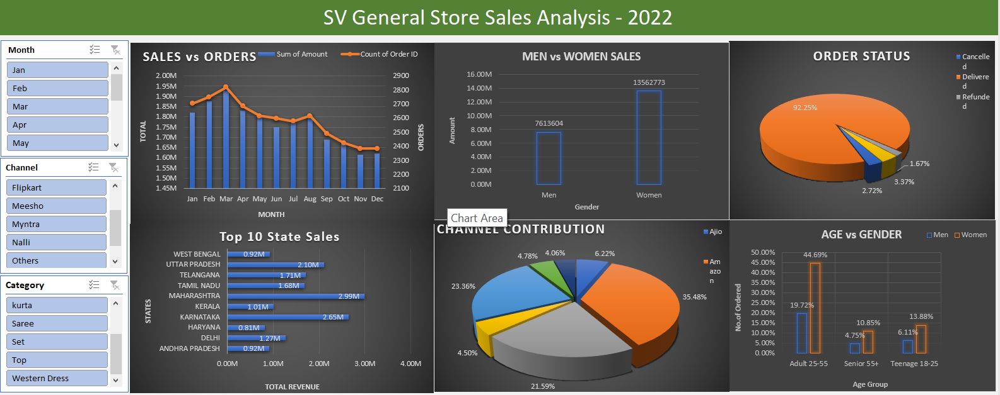

# 🛒 General Store Sales Analysis

## 📖 Overview
This project marks the beginning of my data visualization journey. Using **Microsoft Excel**, I analyzed a general store's sales data to uncover essential business insights while learning the fundamentals of data visualization and analysis.

---

## 🔍 Insights & Analysis
1. **Sales Trends**: Monthly and yearly revenue patterns.
2. **Category Performance**: Identified top-performing product categories.
3. **Customer Segmentation**: Region-wise and customer-wise sales analysis.
4. **Discount Effect**: Evaluated the impact of discounts on sales.

---

## 📂 Project Files
- **Dataset**: [General_Store_Sales.csv](./SV_sales_data.csv)  
  *(Click to view the data used for this analysis)*  
- **Visualization**:  
  

---

## 🛠️ Skills Acquired
- Data cleaning and formatting in Excel.
- Creation of pivot tables and charts for insights.
- Using formulas to compute metrics like revenue, profit, and discount impact.
- Basic dashboard creation with slicers and filters.

---

## 🌟 Key Takeaway
This project helped me build foundational knowledge in data analysis and visualization using Excel. It boosted my confidence to explore advanced tools like Tableau and Python.
